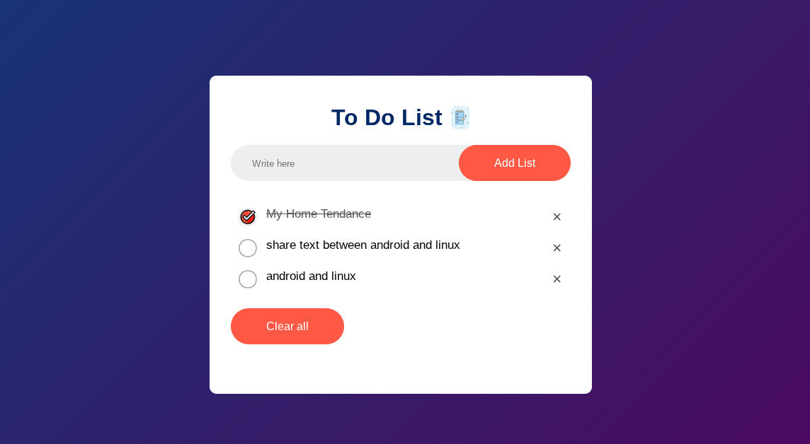

# To-Do List Application

A simple and elegant to-do list web application built with HTML, CSS, and JavaScript. This application allows users to add, check off, and delete tasks with data persistence using localStorage.

## Preview



## Demo

🔗 **Live Demo**: [https://waris24w.github.io/to-do-list](https://waris24w.github.io/to-do-list)

## Features

- ✅ **Add Tasks**: Create new tasks by typing and clicking "Add List" or pressing Enter
- ✅ **Mark Complete**: Click on tasks to mark them as completed with a strikethrough effect
- ✅ **Delete Tasks**: Remove individual tasks by clicking the × button
- ✅ **Clear All**: Remove all tasks at once with the "Clear all" button
- ✅ **Data Persistence**: Tasks are automatically saved to localStorage and restored on page reload
- ✅ **Responsive Design**: Works well on desktop and mobile devices
- ✅ **Keyboard Support**: Add tasks using the Enter key

## Technologies Used

- **HTML5**: Structure and markup
- **CSS3**: Styling with gradients, flexbox, and modern design
- **Vanilla JavaScript**: Functionality and DOM manipulation
- **LocalStorage API**: Data persistence

## File Structure

```
to-do-list/
├── index.html         
├── styles.css          
├── src.js            
├── resourses/       
│   ├── to-do-icon.png
│   ├── checked.png   
│   ├── uncheck.png   
│   └── preview.png   
└── README.md         
```

## Installation & Usage

1. **Clone the repository**:
   ```bash
   git clone https://github.com/waris24w/to-do-list.git
   ```

2. **Navigate to the project directory**:
   ```bash
   cd to-do-list
   ```

3. **Open in browser**:
   - Simply open `index.html` in your web browser
   - Or use a local server like Live Server extension in VS Code

## How to Use

1. **Add a Task**: 
   - Type your task in the input field
   - Click "Add List" button or press Enter

2. **Complete a Task**: 
   - Click on any task to mark it as completed
   - The task will show a strikethrough and checkmark

3. **Delete a Task**: 
   - Click the × button on the right side of any task

4. **Clear All Tasks**: 
   - Click the "Clear all" button to remove all tasks at once

## Key JavaScript Features

- **Event Listeners**: Handles clicks, keyboard input, and task interactions
- **DOM Manipulation**: Dynamically creates and removes HTML elements
- **Local Storage**: Automatically saves and loads tasks between sessions
- **Input Validation**: Prevents adding empty tasks

## CSS Highlights

- **Modern Design**: Beautiful gradient background and clean interface
- **Flexbox Layout**: Responsive and well-aligned components
- **Custom Icons**: Before/after pseudo-elements for task states
- **Hover Effects**: Interactive feedback for better user experience
- **Mobile Responsive**: Adapts to different screen sizes

## Browser Compatibility

This application works in all modern browsers that support:
- ES6 JavaScript features
- CSS3 flexbox
- localStorage API

## Contributing

1. Fork the repository
2. Create your feature branch (`git checkout -b feature/AmazingFeature`)
3. Commit your changes (`git commit -m 'Add some AmazingFeature'`)
4. Push to the branch (`git push origin feature/AmazingFeature`)
5. Open a Pull Request

## License

This project is open source and available under the [MIT License](LICENSE).

## Author

**Waris** - [GitHub Profile](https://github.com/waris24w)

---

⭐ If you found this project helpful, please consider giving it a star on GitHub!
